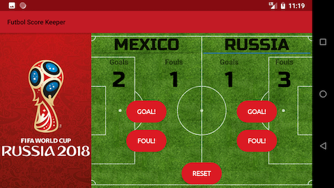

# futbol-score-keeper
## GrowWithGoogle project 2

This is my second project for the Udacity #GrowWithGoogle scholarship program. In this project I am utilizing the concepts learned about relative layout, different views, such as EditText and ImageView, and user inpu, as well as interactivity via event handlers.

# About the app

- Once again implemented landscape layout
- Used event handler functions to keep track of goals and fouls in futbol match
- Added button drawable to make button corners rounder

# Views

